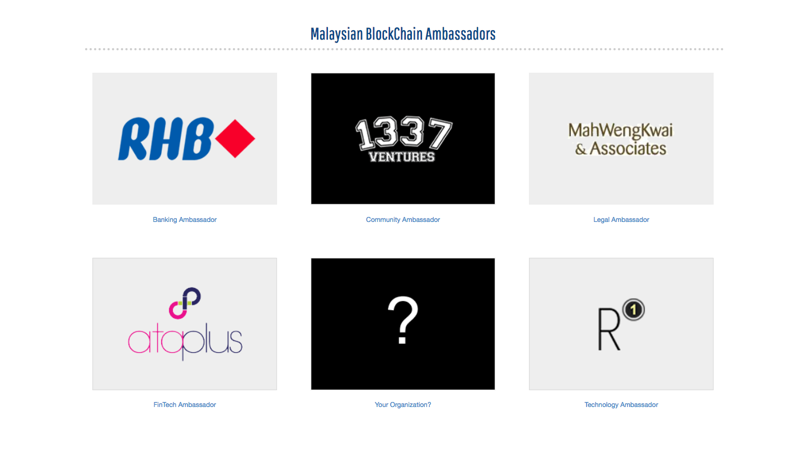
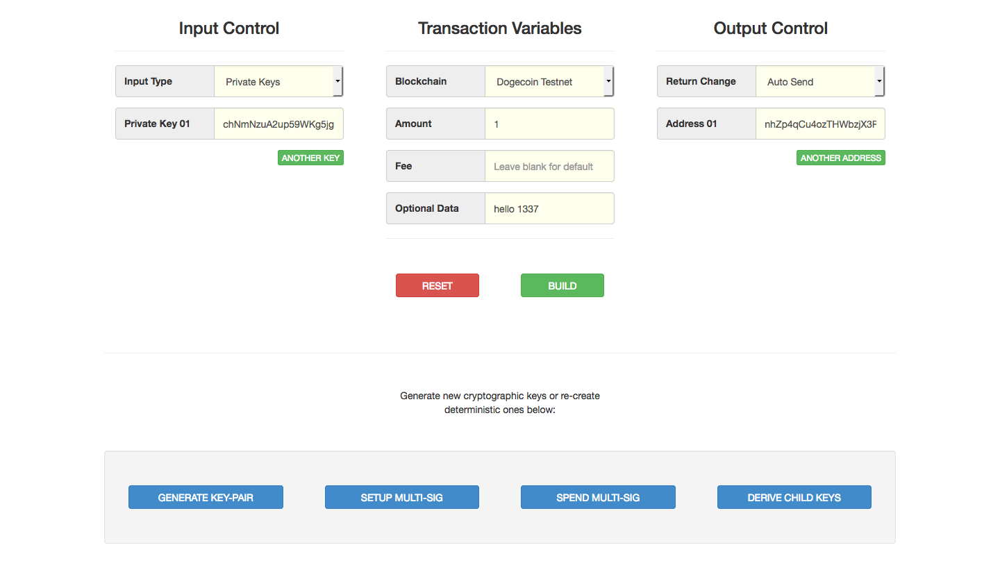
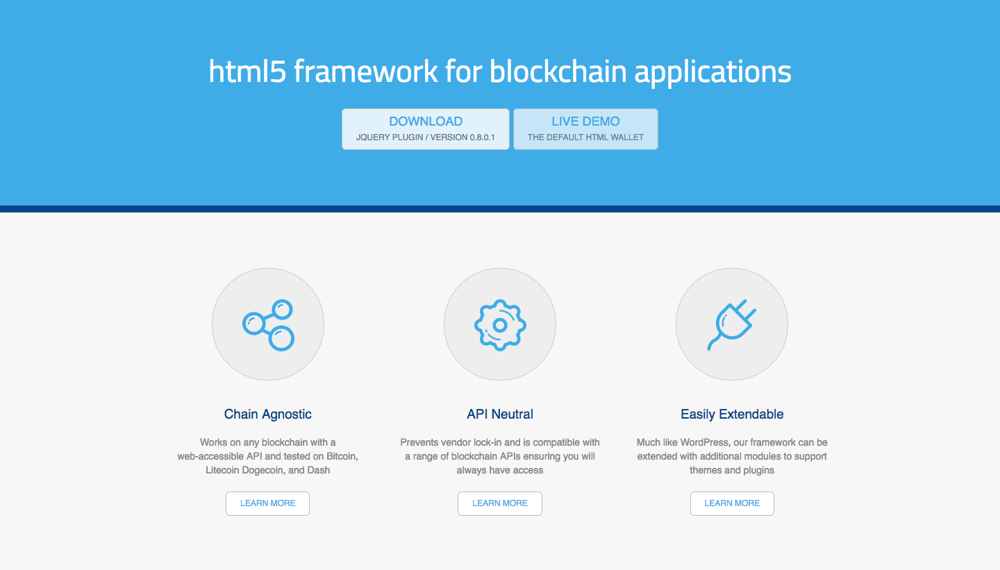

### Introducing The Blockchain Embassy of Asia

[BCE.asia](http://bce.asia) is a non-profit digitally distributed organization that is using and promoting blockchain governance as a method for collaboration between various business entities and existing community efforts across Southeast Asia. We bridge the technical divide between organizations, national agencies and regulators throughout the region by providing access to our growing repositories of collaborative research. Our sandbox environment not only provides a technical foundation for growth, but also features legal frameworks too.

### The Embassy Toolkit

As part of our early research in understanding the basic foundations of crypto-currency based blockchains, we developed a set of inline tools that work within the browser and do not require any form of server-side interaction or exposure to privacy risks. For those that know how to download and investigate code, we have our [public repository](https://github.com/Neuroware-IO/toolbox), but for those that want to play-around with the technology without looking at code, they can visit our [online toolbox](http://bce.asia/toolbox/). It currently supports the following features:

* __Key Creation__ - generate standard and master extended public and private keys as well as the public address
* __Multi-Signature Accounts__ - create new multi-signature addresses and then sign and send transactions
* __Hierarchical Keys__ - check the depth and index of extended keys and derive new children via paths
* __Transaction Builder__ - create and view new transactions from API-driven unspents before relaying

At the moment, we currently have __full__ support the following blockchains:

* Dogecoin Testnet

We will be soon be introducing additional support for the following blockchains:

* Dogecoin
* Bitcoin
* Bitcoin Testnet
* Litecoin
* Litecoin Testnet
* Dash
* Dash Testnet
* Ethereum
* Ethereum Testnet
* Ethereum Classic
* Ethereum Classic Testnet

This blockchain-agnostic support is provided by the [blockstrap](http://blockstrap.com) framework:

